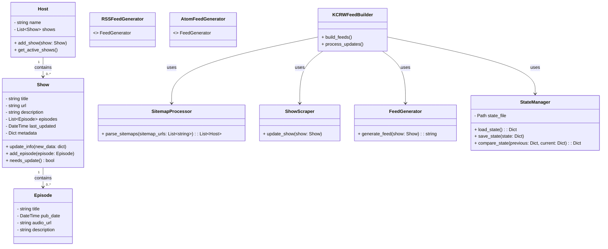
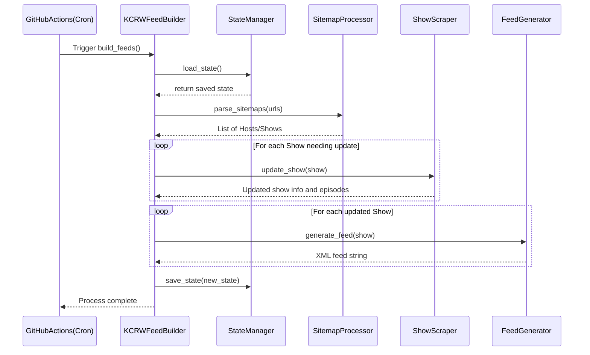

# KCRW Feed

## General Goal & Approach

The goal is to make it easy to find and download the various music shows from kcrw.com. I want to built only what I need to build, and leverage other services where possible. I want to build this as a public open source project and host the functionality for zero dollars on an ongoing basis.

Background: Typically KCRW DJs produce music shows on a weekly or daily basis and make them available as mp3 files on their website (and available through their iOS and Android apps) -- example shows that I love include Dan Wilcox's weekly show, and Travis Holcolmbe's daily Freaks Only.

Here's the rough outline of what I'm thinking of so far:

- I plan to write a python script to regularly scrape the kcrw.com site to generate the list of 1) music shows, and 2) the episodes of each show

- I'd like to publish the shows using RSS or Atom in order to make them easy to download programmatically, and to integrate with preexisting pod catchers (and so I don't have to write a client)

- I do not want to host any of the episode mp3 files directly, just point to the files served up by kcrw.com. They own this content; I'm just providing an easy to use index, essentially

- I want to make the project a public Open Source project and host it in Github

- I want to use GH Actions to regularly run the python script to generate the RSS/Atom feeds

- I want to write the xml feed files themselves into the repository itself, and actually serve them directly from GH, too. That is, I want to be able to point my pod catcher (or script) to GH to pull the up to date feed file(s)

- A nice to have would be to also provide any additional metadata (e.g. setlists that come with the shows) as show notes that can be downloaded along with the shows themselves

- I want to make it easy for others to clone the repository and send PRs with bug fixes, features, or other improvements. For example, I'd like advice about what sort of Python packaging to use (e.g. Poetry) to make things clean, clear and easy

- After building this and setting it up, I want the maintenance burden to be truly minimal

- In the unlikely event that KCRW wants to run this themselves and host it on kcrw.com, I want to make it trivial for them to do so

I'm working of this project as much to learn as I am to build the thing, so learning is a core goal.

---

# Class Diagram



---

# Sequence Diagram



---

# Directory Structure

```
.
├── LICENSE
├── README.md
├── poetry.lock
├── pyproject.toml
├── kcrw_feed
│   ├── __init__.py
│   ├── main.py             # Entry point / CLI that orchestrates everything.
│   ├── models.py           # Data models: Host, Show, Episode.
│   │
│   ├── processors          # Scraping/processing logic.
│   │   ├── __init__.py
│   │   ├── sitemap_processor.py
│   │   └── show_scraper.py
│   │
│   ├── feeds               # Feed generation code.
│   │   ├── __init__.py
│   │   ├── feed_generator.py   # Base class / common logic.
│   │   ├── rss_feed_generator.py
│   │   └── atom_feed_generator.py
│   │
│   └── state_manager.py    # State persistence functionality.
│
├── feeds                   # Directory for generated feed files.
│   └── ...                 # RSS/Atom XML output goes here.
│
└── tests
    ├── __init__.py
    ├── test_models.py
    └── ...                # Additional tests, possibly mirroring the package structure.
```

---

# License
This project is licensed under the GPL-3.0 License.

# Contact
If you have any questions or suggestions, please open an issue on the GitHub repository. You can also reach me by [email](mailto:cram%40greenavenger.com).

Happy listening!