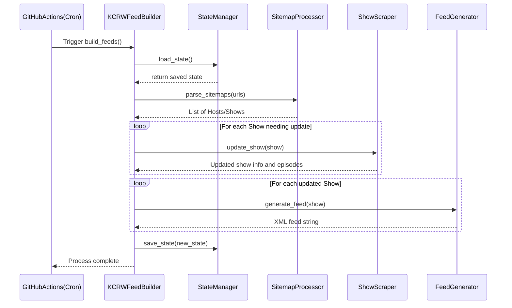
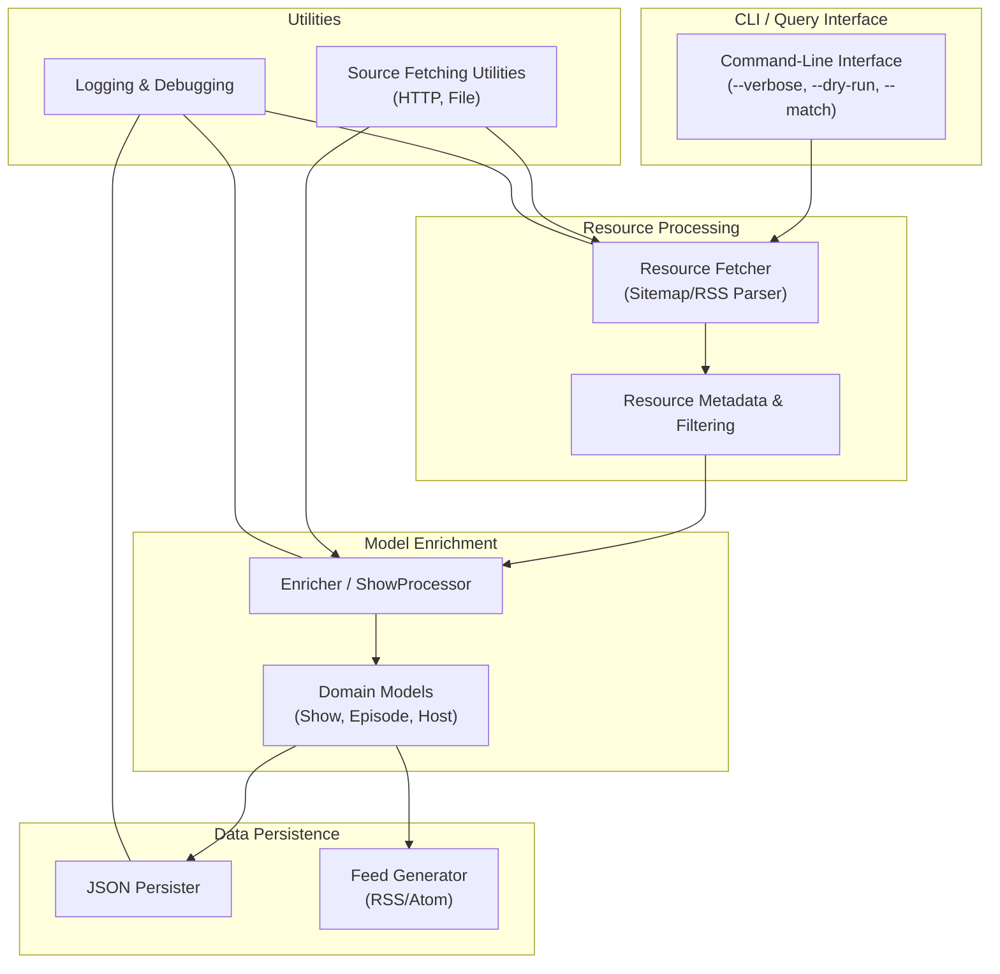

# KCRW Feed

## General Goal & Approach

The goal is to make it easy to find and download the various music shows from kcrw.com. I want to built only what I need to build, and leverage other services where possible. I want to build this as a public open source project and host the functionality for zero dollars on an ongoing basis.

Background: Typically KCRW DJs produce music shows on a weekly or daily basis and make them available as mp3 files on their website (and available through their iOS and Android apps) -- example shows that I love include Dan Wilcox's weekly show, and Travis Holcolmbe's daily Freaks Only.

Here's the rough outline of what I'm thinking of so far:

- I plan to write a python script to regularly scrape the kcrw.com site to generate the list of 1) music shows, and 2) the episodes of each show

- I'd like to publish the shows using RSS or Atom in order to make them easy to download programmatically, and to integrate with preexisting pod catchers (and so I don't have to write a client)

- I do not want to host any of the episode mp3 files directly, just point to the files served up by kcrw.com. They own this content; I'm just providing an easy to use index, essentially

- I want to make the project a public Open Source project and host it in Github

- I want to use GH Actions to regularly run the python script to generate the RSS/Atom feeds

- I want to write the xml feed files themselves into the repository itself, and actually serve them directly from GH, too. That is, I want to be able to point my pod catcher (or script) to GH to pull the up to date feed file(s)

- A nice to have would be to also provide any additional metadata (e.g. setlists that come with the shows) as show notes that can be downloaded along with the shows themselves

- I want to make it easy for others to clone the repository and send PRs with bug fixes, features, or other improvements. For example, I'd like advice about what sort of Python packaging to use (e.g. Poetry) to make things clean, clear and easy

- After building this and setting it up, I want the maintenance burden to be truly minimal

- In the unlikely event that KCRW wants to run this themselves and host it on kcrw.com, I want to make it trivial for them to do so

I'm working of this project as much to learn as I am to build the thing, so learning is a core goal.

---

# Class Diagram


---

# Sequence Diagram



---

# Directory Structure

```
.
├── LICENSE
├── README.md
├── poetry.lock
├── pyproject.toml
├── kcrw_feed
│   ├── __init__.py
│   ├── main.py             # Entry point / CLI that orchestrates everything.
│   ├── models.py           # Data models: Host, Show, Episode.
│   │
│   ├── processors          # Scraping/processing logic.
│   │   ├── __init__.py
│   │   ├── sitemap_processor.py
│   │   └── show_scraper.py
│   │
│   ├── feeds               # Feed generation code.
│   │   ├── __init__.py
│   │   ├── feed_generator.py   # Base class / common logic.
│   │   ├── rss_feed_generator.py
│   │   └── atom_feed_generator.py
│   │
│   └── state_manager.py    # State persistence functionality.
│
├── feeds                   # Directory for generated feed files.
│   └── ...                 # RSS/Atom XML output goes here.
│
└── tests
    ├── __init__.py
    ├── test_models.py
    └── ...                # Additional tests, possibly mirroring the package structure.
```

---
# Rough Stats

- Show count: 67
- Episode count: ~18k

## Top few

| # Episodes | Show |
| ---------: | ---- |
| 4743 | todays-top-tune |
| 4590 | morning-becomes-eclectic |
| 1000 | travis-holcombe |
| 828 | henry-rollins |
| 665 | album-preview |
| 503 | metropolis |
| 494 | tom-schnabels-rhythm-planet |
| 443 | raul-campos |
| 416 | nic-harcourt |
| 391 | guest-dj-project |
| 332 | chris-douridas |
| 308 | garth-trinidad |
| 233 | jason-kramer |
| 226 | ro-wyldeflower-contreras |
| 199 | leroy-downs |
| 199 | dan-wilcox |

---

# Refactor After Prototype

Thinking about the high level structure, I think there are three major pieces.

## Primary Components

1) resource processing
- data model: here each show and episode are represented as a  "resource", which his a (unique?) URL
  - each resource/URL has metadata, the most important of which is `lastmod` (and `priority`, if we want to use it to inform our http caching policy)
- function: the thing we need to do is to get a list of resources from the sitemap.xml files (the root of which comes from robots.txt)
- source: sitemap xml files (do I want to read from RSS?)
- load: doing this has little impact on the kcrw.com website, since we're fetching just ~4 files
- filtering:
  - sitemap: we only look at base/root and `music` related sitemaps
  - resource/show: we only look for URLs that include `music/shows`, or by show name (the next part of the URL after `music/shows`)
  - time restrict: we may want to restrict the resources we consider(i.e. last day, 2 weeks ago to 1 week ago, etc.)
- persistence: we don't persist the sitemap/resource data directly, rather we include it into the JSON persistence file (though they do get stored in a local HTTP cache)

2) model "enrichment"
- data model: Show, Episode, Host
  - relationships:
    - a show has 1 or more episodes
    - a show has 1 or more hosts
    - an episode has 1 or more hosts
  - data: `title`, `airdate`, `media_url`, `last_updated`, etc.
- function: here we use the resources (URL) for each show and episode to a) fetch the html/json, b) parse the returned data and enrich the core models (show populates Show and Host, episode populates Episode).
- sources:
  - resources fetched from kcrw.com
  - objects read from persistent JSON file
- filtering:
  - resource/show:
  - time restrict:
  - dry run: show me what resources you're going to update, but don't do it yet
- persistence: we persist all enriched data into a local JSON file for easy integration into a VCS

3) data persistence
- data model: Directory - container for all shows + metadata (e.g. "last_updated")
- targets:
  - JSON
  - feeds (RSS/Atom)
- filtering:
  - JSON: none
  - feeds:
    - resource/show
    - time restrict

## Subsystems/Support or Utility Functionality
1) source fetching: file based or HTTP
- persistence:
  - enriched models
  - debugging html/json -> if we have a parse failure, we should save a copy of the collected html/json to be able to replay and debug it
2) list or query interface:
- function: list resources, shows, episodes, hosts
- filtering:
  - resource/show:
  - time restrict:

## User Tasks
1) GH Action: fetch updated and regenerate feeds that have changed
2) list raw resources (sitemap or JSON based?)
- filtering:
  - resource/show:
  - time restrict:
3) update all or a subset of
- filtering:
  - resource/show:
  - time restrict:
  - dry run: show me the resources to be updated, but don't do it yet
4) debug:
  - common scenarios:
    - figure out why a show/episode isn't parsing
    - figure out why episodes aren't show up for a show
    - figure out why a show is missing
- filtering:
  - resource/show:

## Global Options
- `--verbose`
- `--dry-run`
- `--match`

---
# CLI

```
$ poetry run kcrw-feed --help
usage: kcrw-feed [-h] [-v] [-n] [-m MATCH_LIST] [-s TIMESTAMP] [-u TIMESTAMP] [--loglevel {trace,debug,info,warning,error,critical}] [-o STORAGE_ROOT] [-r SOURCE_ROOT] {list,update} ...

KCRW Feed Generator

positional arguments:
  {list,diff,update}
    list                List resources, shows, episodes, or hosts in feeds (local state)
    diff                Show differences between local state and the live site (kcrw.com)
    update              Update show data from live site (kcrw.com)

options:
  -h, --help            Show this help message and exit
  -v, --verbose         Increase verbosity of returned entities
  -n, --dry-run         Do not perform any destructive actions. (ex. "update -n" provides a diff)
  -m, --match MATCH_LIST
                        A regex or substring to filter resource URLs (ex. "valida", "shows/valida", "valida.*-2023")
  -s, --since ISO_8601_TIMESTAMP
                        Reprocess since provided ISO 8601 timestamp (“YYYY-MM-DDTHH:MM:SS”)
  -u, --until ISO_8601_TIMESTAMP
                        Reprocess until provided ISO 8601 timestamp (“YYYY-MM-DDTHH:MM:SS”)
  --loglevel {trace,debug,info,warning,error,critical}
                        Override log level for stdout debug logging
  -o, --storage_root STORAGE_ROOT
                        Specify the root data directory for state and feed files
  -r, --source_root SOURCE_ROOT
                        Specify the source root (ex. "https://www.kcrw.com/", "./tests/data/")
```

---
# Updated Component/Flow Diagram



---

# Updated Directory Structure
```
kcrw_feed/
├── __init__.py
├── config.py
├── models.py             # Show, Episode, Host, etc.
├── persistence/
│   ├── __init__.py
│   ├── json_persister.py  # JSON persister
│   ├── rss.py             # RSS feed persister (using Django's feedgenerator)
├── processing/
│   ├── __init__.py
│   ├── resource_fetcher.py  # For fetching and filtering resources
│   ├── enricher.py          # For enriching Show/Episode models
├── source_manager.py     # BaseSource and concrete implementations
└── cli.py                # Command-line interface
```

---

# License
This project is licensed under the GPL-3.0 License.

# Contact
If you have any questions or suggestions, please open an issue on the GitHub repository. You can also reach me by [email](mailto:cram%40greenavenger.com).

Happy listening!